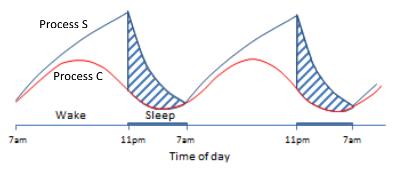

# Two-Process-Sleep-Model

🔗 **Live Web App:**  
🚀 Try the interactive Streamlit app [here](https://two-process-sleep-model-web-apppy-gmw6dsz84yyfiumi2dv5rq.streamlit.app/)

## About the Two process sleep model app

An interactive implementation of the Borbély/Daan two-process model of sleep regulation with:
- Circadian thresholds (U and L)
- Homeostatic sleep pressure (S)
- Sleep/wake simulation
- Double-plotted actograms
- Interactive parameter tuning

  ## Features

- Adjustable circadian parameters
- Adjustable sleep pressure buildup/decay rates
- Dynamic visualization of:
  - Sleep pressure (S)
  - Upper/Lower thresholds (U/L)
  - Sleep-wake state
  - Double-plotted actograms
  ## What is  Two process model?

The two-process model of sleep regulation, originally proposed by Alexander Borbély and colleagues [Daan et al](https://pubmed.ncbi.nlm.nih.gov/6696142/), explains sleep timing as the interaction between two biological processes: a homeostatic process (Process S) and a circadian process (Process C). Process S represents sleep pressure that accumulates during wakefulness and dissipates during sleep, while Process C is the internal circadian clock that modulates the timing of sleep and wakefulness across the day. Together, these interacting processes generate daily sleep–wake patterns and help explain phenomena such as sleep deprivation, recovery sleep, and ultradian rhythms.

## The two process model



## Model Equations

### Sleep Pressure Buildup (Wake State)

The buildup of sleep pressure during wakefulness is modeled as:

$$
S_t = 1 - e^{-\Delta t / t_i}(1 - S_{t-1})
$$

where:

-  \S_t = sleep pressure at time \( t \)
- \( t_i \) = buildup time constant
-  $\Delta t$  = simulation time step

---

### Sleep Pressure Decay (Sleep State)

The decay of sleep pressure during sleep is modeled as:

$$
S_t = e^{-\Delta t / t_d} S_{t-1}
$$

where:

- \( t_d \) = decay time constant

---

### Circadian Upper Threshold

$$
U = M_u + A_u \cos(\omega t + \phi)
$$

where:

- \( M_u \) = mean upper threshold
- \( A_u \) = upper threshold oscillation amplitude

---

### Circadian Lower Threshold

$$
L = M_l + A_l \cos(\omega t + \phi)
$$

where:

- \( M_l \) = mean lower threshold
- \( A_l \) = lower threshold oscillation amplitude

---

### Circadian Angular Frequency

$$
\omega = \frac{2\pi}{\tau}
$$

where:

- \( \tau \) = circadian period
```
